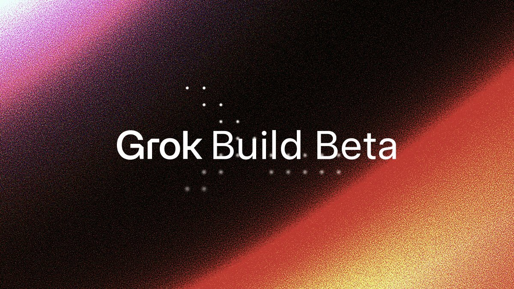
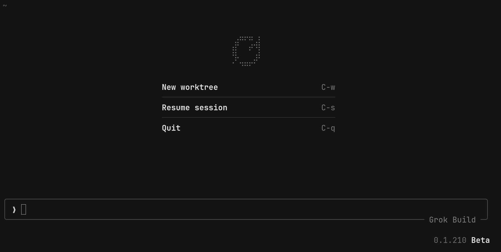
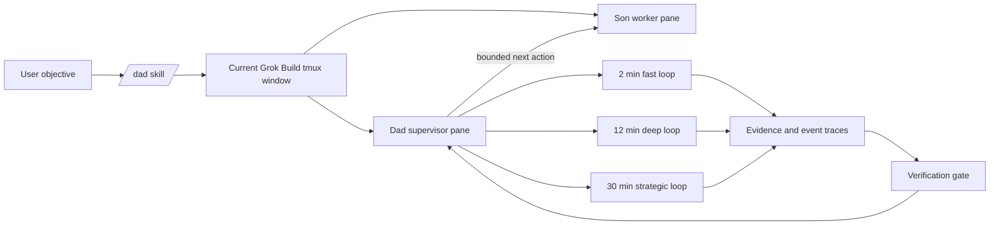

# DAD

<p align="center">
  
</p>

<p align="center">
  <a href="LICENSE"></a>
  
  
  
</p>

<p align="center">
  <a href="#quick-start">Quick start</a> |
  <a href="#why-dad">Why DAD</a> |
  <a href="#what-it-does">What it does</a> |
  <a href="#commands">Commands</a> |
  <a href="#validation">Validation</a>
</p>

**DAD is a Grok Build plugin for long-running automated workflows.**

It turns one Grok Build tmux window into a supervised Dad/Son workspace:
the Son does the work, Dad keeps the run alive, detects stalls and weak claims,
records evidence, repairs scheduler drift, and refuses to accept "done" without
real verification.

If you use AI agents for multi-step implementation, audits, debugging, or repo
exploration, DAD is the supervision layer that keeps the session bounded,
observable, and recoverable.

## Quick Start

In Grok Build:

```text
/plugins
```

Add:

```text
tetsuo-ai/dad
```

Enable or trust the plugin, then run:

```text
/dad "audit this repository and keep going until every finding is verified"
```

That is the fastest install path.

New to Grok Build? Try Grok Build at [http://x.ai/cli](http://x.ai/cli).

<p align="center">
  
</p>

<p align="center">
  
</p>

For local development or manual installs:

```bash
git clone https://github.com/tetsuo-ai/dad.git
cd dad

mkdir -p "${GROK_HOME:-$HOME/.grok}/plugins"
ln -s "$PWD" "${GROK_HOME:-$HOME/.grok}/plugins/dad"

python3 dad/bin/dad-doctor.py --platform-only
grok inspect --json | python3 dad/bin/dad-doctor.py --inspect-json -
```

Common modes:

```text
/dad --mode safe "implement the release plan and verify each checkpoint"
/dad --mode review-only "review this repository for release blockers"
/dad --mode yolo "build the demo, run tests, and keep improving it"
```

If an older standalone `~/.grok/skills/dad` install exists, disable it while
testing the plugin so it does not shadow the plugin skill.

## Why DAD

Long-running agent work usually fails in boring, expensive ways:

| Failure mode | What DAD does |
| --- | --- |
| The worker stops at a prompt | Detects idle state and submits one bounded next action |
| The worker says "done" too early | Treats prose as a claim until evidence proves it |
| Verification gets skipped | Runs evidence gates, syntax checks, and workspace matching |
| Recurring supervision drifts | Health-checks scheduler rows and repairs missing loops |
| Branch state goes stale | Tracks real workstream branch metadata and repairs clean drift |
| Recovery helpers race | Uses leases so scheduled Dad turns fail closed instead of overlapping |
| Logs leak sensitive output | Writes private logs under plugin data and redacts common secrets |

The practical rule is simple: **model prose is not proof.** DAD accepts progress
only when command output, changed files, event traces, or evidence gates support
the claim.

## See It

<p align="center">
  
</p>

## What It Does

DAD is more than a prompt wrapper. The plugin ships a real supervision runtime:

- **Two-pane workspace:** Dad supervises, Son executes, both inside the current
  Grok Build tmux window.
- **Native tmux control plane:** no tmux-MCP bridge or external tmux daemon.
- **Three recurring loops:** fast loop every 2 minutes, deep loop every
  12 minutes, strategic loop every 30 minutes.
- **Watchdogs:** Dad watchdog, passive Son watcher, Son loop recovery, and idle
  controller.
- **Evidence gates:** transcript integrity, assertion checks, action-effect
  checks, stale git detection, and workspace identity matching.
- **Scheduler repair:** detects missing scheduler rows, stale repair metadata,
  and recurring-loop drift.
- **Branch hygiene:** keeps one workstream branch and repairs provisional startup
  branch metadata when the real clean work branch is known.
- **Runtime traces:** JSONL events, evidence output, gate decisions, lease files,
  and private daemon logs.
- **Release tooling:** doctor checks, package export, cleanup tools, and
  regression tests.

## How It Works



At startup, `/dad` records the exact tmux socket, window ID, and pane IDs;
splits the current window; starts the Son in the requested mode; installs
non-durable Grok scheduler loops; starts watchdog helpers; and begins writing
event/evidence data under the plugin data root.

Dad supervises the trajectory. The Son performs the project work.

## Commands

```text
/dad "objective"
/dad --mode safe "objective"
/dad --mode review-only "audit this repository"
/dad --mode yolo "objective"
/dad help
/dad status
/dad verify
/dad pause
/dad resume
/dad repair
/dad stop
/dad objective "new objective"
/dad reflect
```

The exact behavior is defined in [skills/dad/SKILL.md](skills/dad/SKILL.md)
and [dad/DAD.md](dad/DAD.md).

## Modes

| Mode | Use it for | Behavior |
| --- | --- | --- |
| `safe` | Default long-running work | Bounded autonomous execution with normal safeguards |
| `review-only` | Audits and release checks | Read-only pressure, no intentional artifact edits |
| `yolo` | Explicit high-autonomy builds | Faster write/execute loop when you want the agent to push |

## Requirements

- Grok Build with plugin support
- Linux with procfs and GNU userland behavior
- `tmux`
- `bash`
- `python3`
- `git`
- `pgrep`, `timeout`, `flock`, `sha256sum`, and GNU `date -d`

Run the doctor before installing on a new machine:

```bash
python3 dad/bin/dad-doctor.py --platform-only
grok inspect --json | python3 dad/bin/dad-doctor.py --inspect-json -
```

## Plugin Layout

```text
.claude-plugin/plugin.json       Plugin manifest
skills/dad/SKILL.md              User-invocable /dad skill
hooks/hooks.json                 Grok hook registration
hooks/scripts/dad-event-hook.sh  Plugin-aware hook wrapper
dad/DAD.md                       DAD operating design
dad/POLICY_VERSION               Scheduler policy version
dad/bin/                         Runtime helpers
dad/tests/                       Regression tests
```

## Runtime Data

Runtime data resolves in this order:

1. `DAD_DATA_ROOT`
2. `GROK_PLUGIN_DATA`
3. `CLAUDE_PLUGIN_DATA`
4. `${GROK_HOME:-~/.grok}/dad-data` for plugin installs
5. bundled `dad/` directory only for local development

Runtime data includes event traces, evidence output, gate decisions, lease
files, private daemon logs, and historical window records. These files are
intentionally ignored by git.

## Safety Boundaries

DAD is intentionally conservative:

- It only operates inside the tmux window where it was invoked.
- It stores exact pane IDs instead of guessing by layout.
- It uses `tmux -S <socket>` for every tmux operation.
- It does not kill processes by broad name or pattern.
- It treats Son summaries as claims, not proof.
- It requires changed files, command output, or other concrete evidence before
  accepting completion.
- It keeps branch state on one workstream branch and repairs stale startup
  branch metadata only when a clean non-trunk work branch becomes the real
  session branch.

## Packaging

Create a clean plugin archive from a checkout:

```bash
bash dad/bin/dad-package.sh --output /tmp/dad-plugin.tar.gz
```

The package exporter excludes runtime state, logs, locks, evidence, events,
bytecode, sockets, and git metadata.

## Validation

Run the regression suite from the plugin root:

```bash
bash dad/tests/test-dad-supervision.sh
```

Optional syntax checks:

```bash
bash -n dad/bin/*.sh dad/tests/test-dad-supervision.sh hooks/scripts/*.sh
python3 -m py_compile dad/bin/*.py
```

## Research Posture

DAD follows the practical shape of modern execution-grounded agent systems:

- real environment feedback over self-reported progress
- iterative refinement after errors and failed checks
- role separation between executor and reviewer/supervisor
- trajectory records instead of final-answer-only evaluation
- long-horizon software work with branch, artifact, and verification hygiene

The goal is not to make agents sound more confident. The goal is to make them
leave behind better receipts.

## Help And Contributions

Open an issue with:

- Grok Build version
- operating system
- `tmux -V`
- output from `python3 dad/bin/dad-doctor.py --platform-only`
- a short description of the `/dad` command and failure mode

Pull requests are most useful when they include a regression test in
`dad/tests/test-dad-supervision.sh` or a clear reason an executable test is not
possible.

## Status

DAD is usable as a local Grok Build plugin for long-running automated workflows.

## License

MIT. See [LICENSE](LICENSE).
